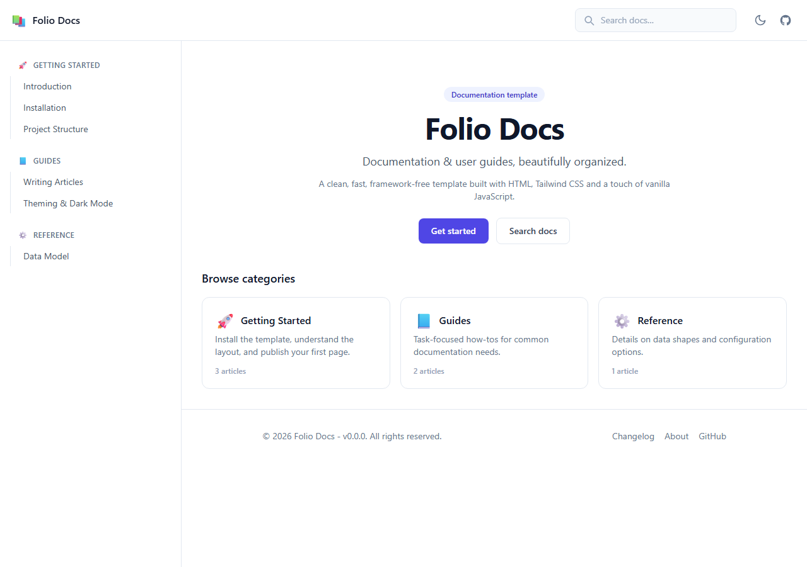
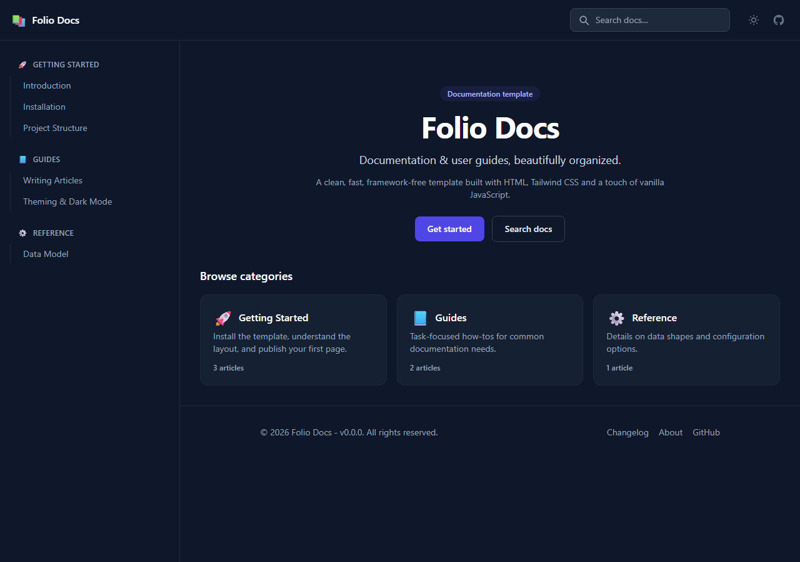
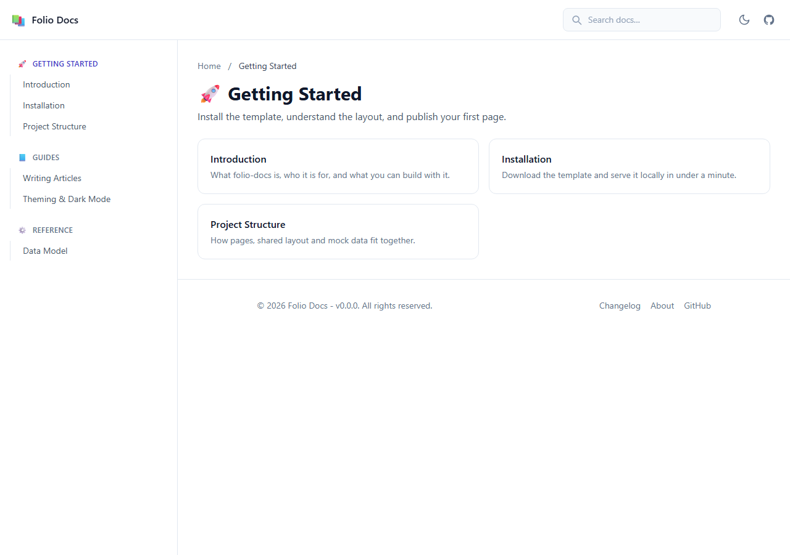
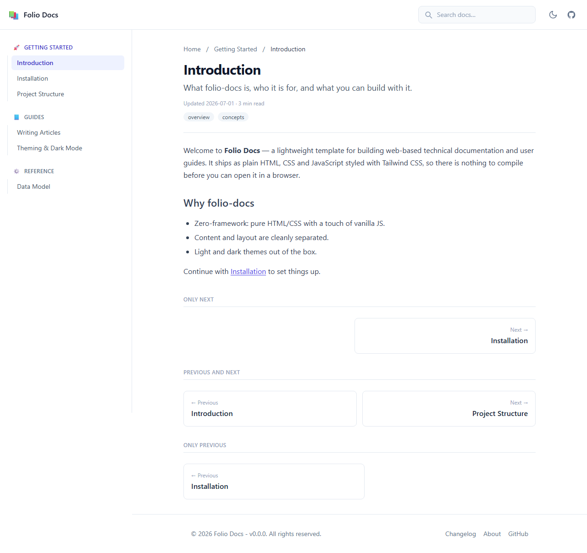
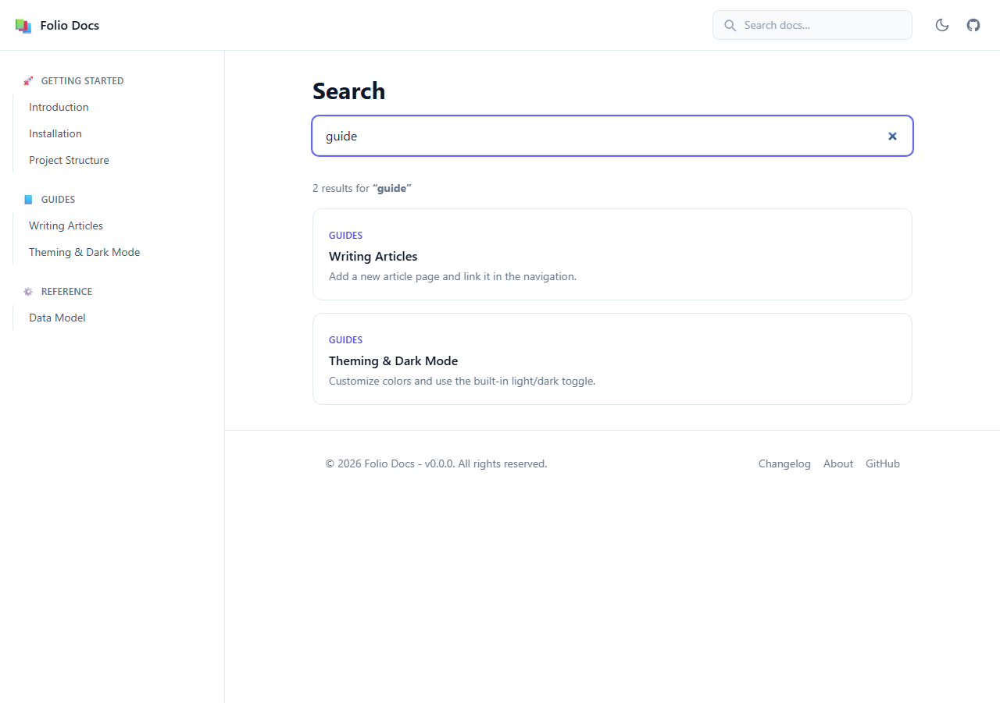
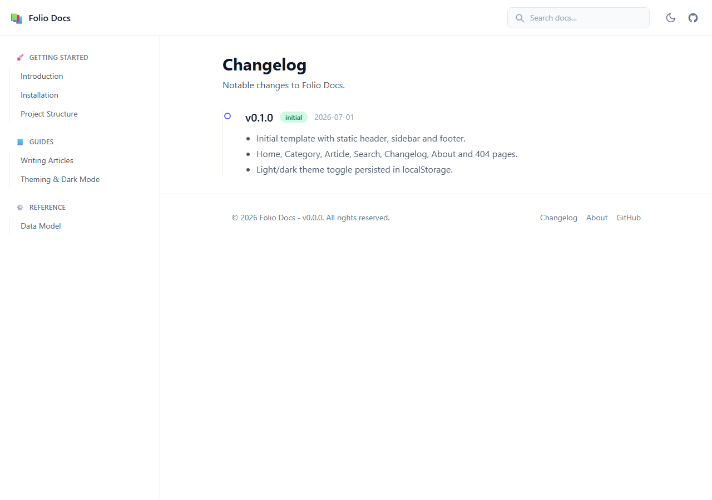
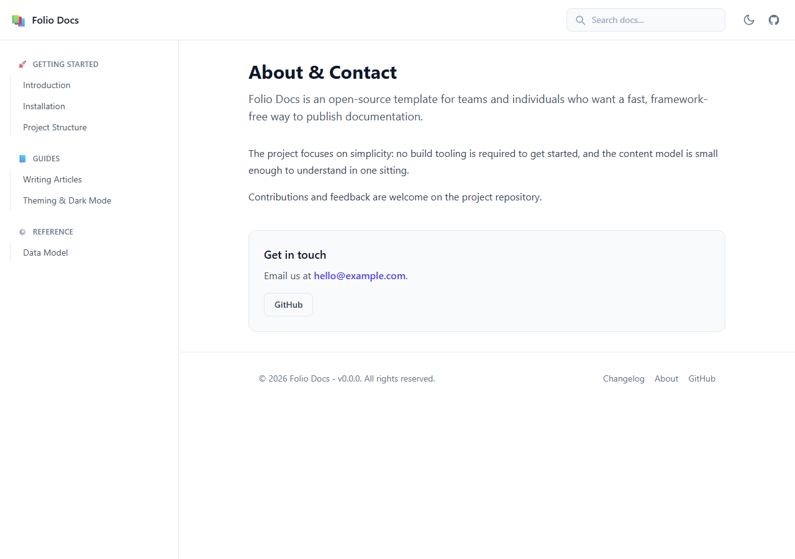
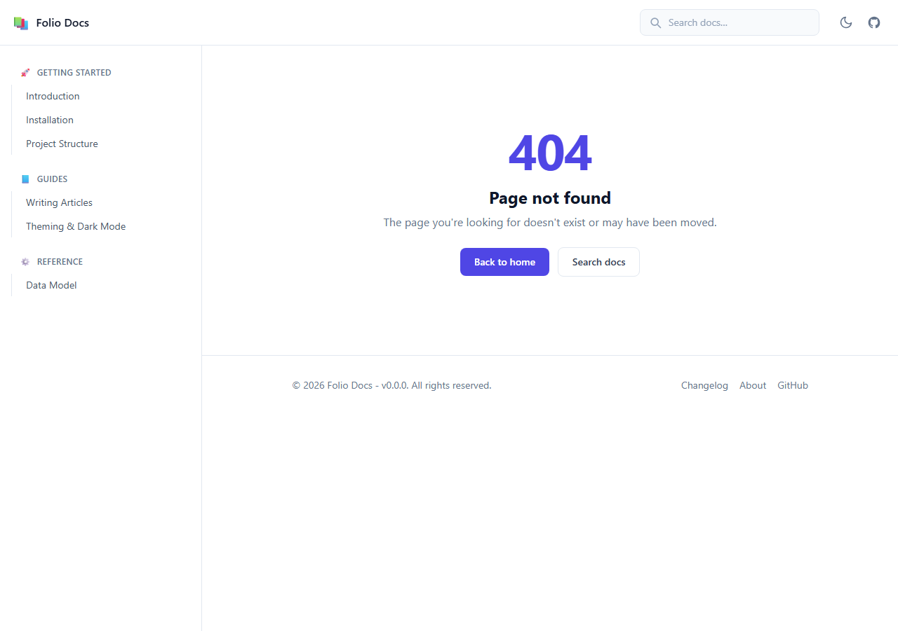

[](https://opensource.org/licenses/MIT)
[](RELEASE-NOTES.md)

folio-docs is a clean, **framework-free** template for building web-based technical documentation and user guides.

Built with plain HTML, vanilla JavaScript and [Tailwind CSS](https://tailwindcss.com) -
every page is complete, editable HTML with no build step and almost no JavaScript.

## Screenshots

The home page in light and dark themes:

| Light | Dark |
| --- | --- |
| [](docs/screenshot-home.png) | [](docs/screenshot-home-dark.png) |

Other page types:

| Category | Article |
| --- | --- |
| [](docs/screenshot-category.png) | [](docs/screenshot-article.png) |

| Search | Changelog |
| --- | --- |
| [](docs/screenshot-search.png) | [](docs/screenshot-changelog.png) |

| About | 404 |
| --- | --- |
| [](docs/screenshot-about.png) | [](docs/screenshot-404.png) |

## Features

- 7 page types: Home, Category, Article, Search, Changelog, About, and 404.
- Category → Article content model (an article belongs to one category).
- **Static-first:** every page ships complete HTML for the header, sidebar and
  footer - edit the markup directly, no JavaScript builds the layout.
- **Pure-CSS mobile navigation drawer** (a checkbox + `:has()`, no JS).
- Light / dark theme toggle (the only UI effect that needs JS; persisted in
  `localStorage`).
- Client-side search backed by a single `src/mock-data.js` index.

## JavaScript is deliberately minimal

JS is used for exactly two things, kept in clearly separated files:

- **Data:** `src/mock-data.js` (the search index) consumed by `src/js/search.js`.
- **Effects:** `src/js/effects.js` - theme persistence only.

## Getting started

Serve the `src/` directory with any static file server:

```bash
cd src
npx serve .
```

Then open the printed URL. Because every page is a standalone HTML file, you can
also open `src/index.html` directly in a browser.

## Project structure

```
src/
  index.html            Home / categories index
  category.html         Articles within a category (template)
  article.html          A single article (template)
  search.html           Search & results
  changelog.html        Release notes
  about.html            About / contact
  404.html              Not found
  css/styles.css        Prose styles + pure-CSS mobile drawer
  js/effects.js         Theme-toggle persistence (only effect JS)
  js/search.js          Search feature (only data-consuming script)
  mock-data.js          Search index (data only)
```

## License

[MIT](LICENSE.md)
